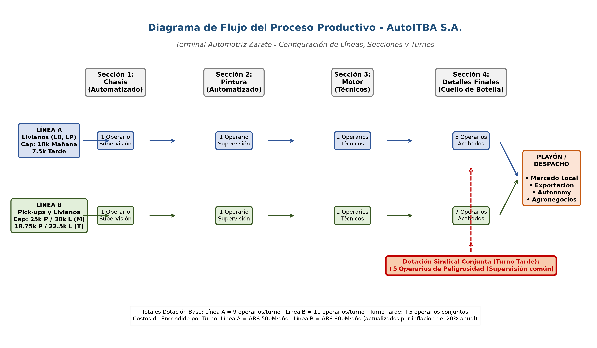
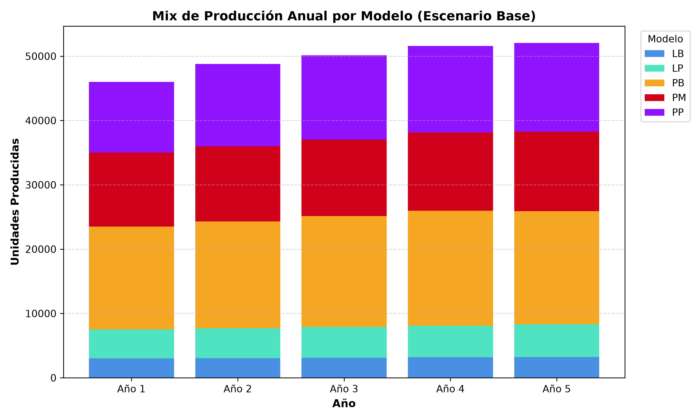
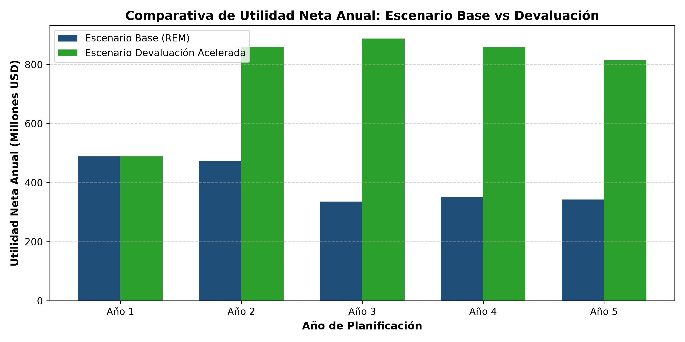
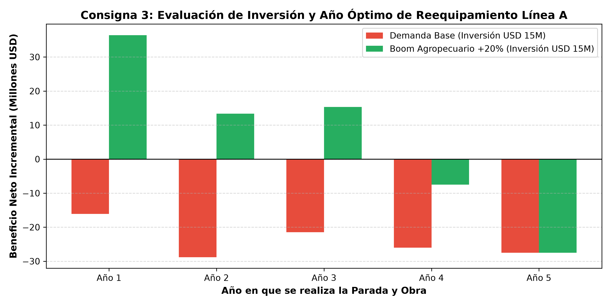
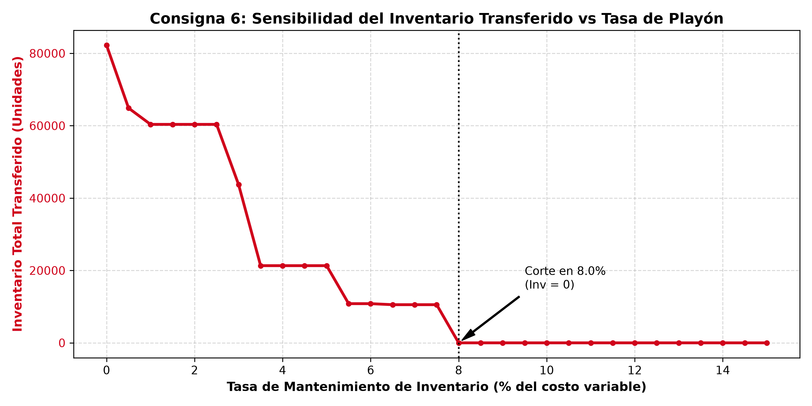

# TRABAJO PRÁCTICO N° 1 COMPLEMENTARIO: INVESTIGACIÓN OPERATIVA (IO51)
## Plan de Producción Estratégico a 5 Años — AutoITBA S.A.
**Instituto Tecnológico de Buenos Aires (ITBA) — 2° Cuatrimestre 2026**

---

### Carátula y Metadatos Institucionales
* **Materia:** 11.51 / IO51 - Investigación de Operaciones (ITBA)
* **Trabajo:** Trabajo Práctico N.º 1 Complementario: "Plan de producción AutoITBA SA"
* **Empresa:** Terminal Automotriz AutoITBA S.A. (Planta industrial Zárate, Provincia de Buenos Aires)
* **Horizonte:** 5 años (Año 1 a Año 5, 2026 - 2030)
* **Portafolio de Productos:**
  * **Vehículos Livianos:** LB (Entrada de gama / utilitario urbano) y LP (Premium / alta tecnología y terminaciones).
  * **Pick-ups:** PB (Cabina simple básica), PM (Cabina doble media) y PP (Superior / alta motorización y equipamiento).
* **Naturaleza del Documento:** Informe Ejecutivo y Académico Autocontenido (Lectura y Evaluación Independiente del Código).
* **Código Fuente y Datos:** Entregados como paquete de archivos adjuntos en el repositorio del proyecto.
* **Repositorio Oficial:** [https://github.com/Santim1897/TP1-IO](https://github.com/Santim1897/TP1-IO)

---

## Nota Institucional: Estructura del Informe y Entrega del Código Adjunto

El presente informe ha sido estructurado conforme a las pautas metodológicas de la cátedra para constituir un **documento técnico integral y autosuficiente**:
* **En el cuerpo del informe** se desarrollan exhaustivamente el planteo matemático formal del modelo (MILP), las tablas cuantitativas completas con los resultados de cada consigna, los análisis post-óptimos de sensibilidad y las interpretaciones gerenciales y de ingeniería industrial. El documento está concebido para ser comprendido y evaluado en su totalidad sin necesidad de abrir el código de programación.
* **El código fuente de soporte**, el motor de resolución y las planillas de parámetros se suministran como **archivos adjuntos** en el repositorio del proyecto:
  * `main.py`: Orquestador principal que ejecuta la suite completa y valida las respuestas.
  * `src/model_engine.py`: Motor de optimización lineal entera mixta formulado con PuLP y resuelto mediante COIN-OR CBC.
  * `src/run_experiments.py`: Rutinas automatizadas de corridas multiescenario, barridos de sensibilidad y cálculo de matrices de arrepentimiento.
  * `src/generate_excel.py`: Generador de la base de datos de parámetros Excel con fórmulas vivas.
  * `data/AutoITBA_Parametros.xlsx`: Base de datos maestra con 7 hojas de parámetros técnicos, económicos y de mercado.
  * `src/generate_charts.py` y `src/draw_process.py`: Generación de gráficos analíticos y diagramas de proceso a 300 DPI.

---

## Sección 1: Librerías Utilizadas y Justificación Técnica

Para la formulación, resolución matemática y tratamiento computacional de los escenarios se utilizó el siguiente entorno tecnológico:

| Librería / Herramienta | Versión Empleada | Rol Técnico en el Proyecto |
| :--- | :---: | :--- |
| **Python** | 3.12 / 3.14 | Lenguaje base para el desarrollo del motor analítico y la automatización de flujos de trabajo. |
| **PuLP** | 3.3.2 | Modelado algebraico declarativo de variables enteras y continuas, restricciones y función objetivo. |
| **COIN-OR CBC** | 2.10 | Solver de optimización matemática de alto rendimiento basado en Branch & Bound y planos de corte. |
| **Pandas** | 3.0.6 | Procesamiento matricial, agregación de series de producción a 5 años y cálculo de matrices de arrepentimiento. |
| **OpenPyXL** | 3.1.5 | Generación y lectura de planillas de cálculo Excel con preservación de formatos y fórmulas vivas. |
| **Matplotlib** | 3.11.2 | Generación de diagramas de dispersión, gráficos de barras apiladas y curvas paramétricas continuas. |

---

## Sección 2: Resumen Ejecutivo y Cuadro Consolidado de Respuestas

A través de un modelo de **Programación Lineal Entera Mixta (MILP)** multiperíodo, se optimizó el plan maestro de producción de AutoITBA S.A. para el quinquenio 2026-2030 en su planta de Zárate. El modelo resuelve de manera simultánea los volúmenes de ensamble de cinco modelos de vehículos, la activación discreta de turnos en sus dos líneas fabriles, la gestión de inventario interanual en playón y la satisfacción de la demanda del mercado interno, exportaciones al MERCOSUR y contratos especiales.

### Cuadro Síntesis de Respuestas y Decisiones Clave

| Consigna | Planteo Central | Resultado Numérico Obtenido | Justificación y Decisión Estratégica |
| :--- | :--- | :--- | :--- |
| **1. Plan Maestro Base** | Optimización de turnos, mix y stock a 5 años | **Utilidad: USD 1.993,49 M** (Inv = 0 u) | Línea A Mañana (Livianos); Línea B Mañana y Tarde (Pick-ups). 100% demanda cubierta hasta Año 4; en Año 5 se satura Línea B (98,8% capacidad) y se racionan 282 u de PB local. |
| **2. Devaluación Acelerada** | Impacto de un salto del tipo de cambio ($3.550) | **Utilidad: USD 3.910,05 M (+96,1%)** | Los costos en pesos se licúan al medirse en USD. El turno tarde en Línea B es indispensable. Se mantiene prioridad absoluta en exportaciones (+5% sobreprecio). |
| **3. Reequipamiento Línea A** | Inversión USD 12M-18M para pick-ups | **Base:** Inviable (-USD 16M a -31M) **Boom (+20%):** Beneficio neto de **+USD 33M a +USD 39M** | Sin boom, parar la Línea A 1 año destruye márgenes de autos que Línea B ya cubría. Con Boom Agropecuario, **conviene plenamente** y el año óptimo de obra es el **Año 1**. |
| **4. Importación China** | Reemplazo de livianos locales desde Año 2 | **Base:** Conviene (+USD 109,7 M) **Devaluación:** Destruye (-USD 115,7 M) **Cierre Año 3:** Pérdida de -USD 69,1 M | Estrategia de altísimo riesgo cambiario y arancelario. No desmantelar la planta local de Zárate bajo ninguna circunstancia. |
| **5. Contrato Autonomy** | Conveniencia de 1.000 LB anuales a USD 27.500 | **Costo oportunidad: +USD 5,17 M** Precio umbral: **USD 28.534 / unidad** | En Años 3 a 5, el costo variable supera al precio ($29.500 vs $27.500). **Rechazar o renegociar a mínimo USD 28.550/u**. Hay capacidad ociosa en Línea A. |
| **6. Costo de Posesión** | Sensibilidad al costo de inventario (25%-30%) | **Inv = 0 unidades a 25% y 30%** Punto de corte analítico: **8,8% anual** | Al 25% y 30% el costo financiero supera cualquier beneficio de anticipación. Solo convendría guardar stock si la tasa fuera inferior al 8,8%. Operar Just-in-Time. |
| **7. Recomendación Global** | Toma de decisiones bajo incertidumbre (Savage) | Arrepentimiento S1 (Local): **USD 109,7 M** Arrepentimiento S3 (China): **USD 115,7 M** | **Flexibilidad Local con Opciones Reales:** En Años 1 y 2 mantener planta operativa. Esperar al cierre del Año 2 reduce el arrepentimiento a **USD 15,4 M (Óptimo)**. |

---

## Sección 3: Planteo Formal del Modelo Matemático (MILP)

### 3.1 Supuestos Operativos, Económicos y Comerciales

1. **Unidad Monetaria Homogénea (USD sin descontar):** El precio de venta se percibe en dólares y la función objetivo consolida todos los flujos en USD sin aplicar tasa de descuento intertemporal, optimizando el flujo de caja nominal acumulado a 5 años.
2. **Dinámica Inflacionaria y Conversión Cambiaria:** Los costos operativos en Zárate (mano de obra, gastos fijos de encendido e insumos locales) se indexan anualmente al ritmo de la inflación proyectada del 20% anual:
   $$\text{FactorInflacion}(t) = (1 + 0,20)^{t-1}$$
   Para convertirlos a dólares en cada año $t$, se divide por el tipo de cambio oficial esperado ($TC_t$).
3. **Flexibilidad Tecnológica y Tasa de Sustitución en Línea B (Ratio 1,2):** La Línea B puede procesar 30.000 livianos o 25.000 pick-ups por turno mañana al año. El ratio técnico de absorción de capacidad es $30.000 / 25.000 = 1,20$. Cada pick-up absorbe un 20% más de tiempo de ciclo que un auto liviano.
4. **Capacidad y Precedencia Jerárquica del Turno Tarde:** La capacidad del turno tarde es exactamente el 75% del turno mañana (Línea A: 7.500 livianos; Línea B: 18.750 pick-ups). No es factible activar el turno tarde sin tener previamente encendido el turno mañana en esa misma línea ($y_{l,t} \le w_{l,t}$).
5. **Regla Sindical de Peligrosidad (Operarios Compartidos):** Si al menos una línea fabril opera en turno tarde, se incorporan 5 operarios adicionales comunes en detalles finales. Su costo salarial se devenga una única vez en el año si hay turno tarde en planta.
6. **Balance Dinámico de Inventario y Costo de Posesión:** El inventario inicial en Año 1 es cero ($I(v, 0) = 0$). Mantener un vehículo almacenado en playón de un año al siguiente devenga un costo anual del 25% de su costo variable de fabricación en dicho año.
7. **Diferencial de Exportación (+5% MERCOSUR):** Las pick-ups exportadas perciben un sobreprecio del 5% sobre el precio de lista local por flete, prima regional y reintegros arancelarios.

---

### 3.2 Definición Formal de Variables de Decisión

El modelo formula **135 variables de decisión**: 110 continuas y 25 binarias.

| Variable | Dominio Matemático | Cantidad | Descripción Física y Rol Económico |
| :--- | :---: | :---: | :--- |
| $X(v, l, s, t)$ | Real $\ge 0$ | 70 | Volumen del vehículo $v$ ensamblado en la línea $l \in \{A, B\}$, turno $s \in \{M, T\}$, en el año $t \in \{1,\dots,5\}$. |
| $sLoc(v, t)$ | Real $\ge 0$ | 25 | Unidades comercializadas del modelo $v$ en el mercado interno durante el año $t$. |
| $sExp(v, t)$ | Real $\ge 0$ | 15 | Unidades de pick-ups ($PB, PM, PP$) exportadas a países del MERCOSUR en el año $t$. |
| $I(v, t)$ | Real $\ge 0$ | 25 | Inventario en playón del modelo $v$ al cierre del año $t$ (condición de borde: $I(v, 0) = 0$). |
| $wA(t), wB(t)$ | Binaria $\{0, 1\}$ | 10 | Toma valor 1 si se activa el **Turno Mañana** de la Línea A / Línea B en el año $t$; 0 en caso contrario. |
| $yA(t), yB(t)$ | Binaria $\{0, 1\}$ | 10 | Toma valor 1 si se activa el **Turno Tarde** de la Línea A / Línea B en el año $t$; 0 en caso contrario. |
| $z(t)$ | Binaria $\{0, 1\}$ | 5 | Toma valor 1 si al menos una línea opera el Turno Tarde en el año $t$ (activa los 5 operarios sindicales). |

---

### 3.3 Función Objetivo (Funcional Z)

$$\max Z = \sum_{t=1}^5 \left[ \text{Ingresos}(t) - \text{Costos\_USD}(t) \right]$$

Donde los componentes anuales se definen analíticamente como:
* **Ingresos Anuales:**
  $$\text{Ingresos}(t) = \sum_{v} sLoc(v, t) \cdot P_{\text{local}}(v) + \sum_{v \in \text{pickups}} sExp(v, t) \cdot \left[ P_{\text{local}}(v) \cdot 1,05 \right] + \text{Autonomy}(t) \cdot 27.500$$
* **Costos Expresados en Dólares:**
  $$\text{Costos\_USD}(t) = \frac{C_{\text{var}}(t) + C_{\text{inv}}(t) + C_{\text{encendido}}(t) + C_{\text{laboral}}(t)}{TC(t)}$$
  * $C_{\text{var}}(t) = \sum_{v, l, s} X(v, l, s, t) \cdot CV_1(v) \cdot (1,20)^{t-1}$
  * $C_{\text{inv}}(t) = \sum_{v} I(v, t) \cdot 0,25 \cdot CV_1(v) \cdot (1,20)^{t-1}$
  * $C_{\text{encendido}}(t) = \left[ 500.000.000 \cdot (w_A + y_A) + 800.000.000 \cdot (w_B + y_B) \right] \cdot (1,20)^{t-1}$
  * $C_{\text{laboral}}(t) = 26.000.000 \cdot \left[ 8 \cdot (w_A + y_A) + 10 \cdot (w_B + y_B) + 5 \cdot z \right] \cdot (1,20)^{t-1}$

---

### 3.4 Parámetros Económicos, Técnicos y de Mercado

| Parámetro / Concepto Operativo | Año 1 | Año 2 | Año 3 | Año 4 | Año 5 |
| :--- | :---: | :---: | :---: | :---: | :---: |
| **Factor Inflación acumulada (20% a.a.)** | 1,0000 | 1,2000 | 1,4400 | 1,7280 | 2,0736 |
| **Tipo de Cambio Base (ARS/USD)** | $1.500 | $1.750 | $1.950 | $2.350 | $2.800 |
| **Tipo de Cambio Devaluación (ARS/USD)** | $1.500 | $2.200 | $2.650 | $3.100 | $3.550 |
| **Sueldo anual por operario (ARS)** | $26.000.000 | $31.200.000 | $37.440.000 | $44.928.000 | $53.913.600 |
| **Encendido Línea A (USD Base)** | $333.333 | $342.857 | $369.231 | $367.660 | $370.286 |
| **Encendido Línea B (USD Base)** | $533.333 | $548.571 | $590.769 | $588.255 | $592.457 |
| **CV Unitario LB (USD Base)** | $26.667 | $27.429 | $29.538 | $29.413 | $29.623 |
| **CV Unitario LP (USD Base)** | $28.800 | $29.623 | $31.902 | $31.766 | $31.993 |
| **CV Unitario PB (USD Base)** | $38.333 | $39.429 | $42.462 | $42.281 | $42.583 |
| **CV Unitario PM (USD Base)** | $39.483 | $40.611 | $43.735 | $43.549 | $43.860 |
| **CV Unitario PP (USD Base)** | $40.633 | $41.794 | $45.009 | $44.818 | $45.138 |
| **Precios de Lista Local (USD)** | LB: 30.000 | LP: 35.000 | PB: 45.000 | PM: 50.000 | PP: 57.500 |

---

### 3.5 Restricciones Formales del Sistema (135 Ecuaciones)

1. **R1. Precedencia Jerárquica de Turnos (10 ec.):**
   $$y_A(t) \le w_A(t) \quad \text{y} \quad y_B(t) \le w_B(t) \quad \forall t \in \{1,\dots,5\}$$
2. **R2. Activación Sindical de Peligrosidad (15 ec.):**
   $$z(t) \ge y_A(t), \quad z(t) \ge y_B(t), \quad z(t) \le y_A(t) + y_B(t) \quad \forall t$$
3. **R3. Capacidad Máxima de Línea A (10 ec.):**
   $$\sum_{v} X(v, A, M, t) \le 10.000 \cdot w_A(t) \quad \text{y} \quad \sum_{v} X(v, A, T, t) \le 7.500 \cdot y_A(t)$$
   *(La Línea A solo produce livianos; la producción de pick-ups en Línea A es estrictamente cero).*
4. **R4. Capacidad Mixta Flexible de Línea B (10 ec.):**
   $$\frac{\sum_{v \in \text{liv}} X(v, B, M, t)}{30.000} + \frac{\sum_{v \in \text{pick}} X(v, B, M, t)}{25.000} \le 1,0 \cdot w_B(t)$$
   $$\frac{\sum_{v \in \text{liv}} X(v, B, T, t)}{30.000} + \frac{\sum_{v \in \text{pick}} X(v, B, T, t)}{25.000} \le 0,75 \cdot y_B(t)$$
5. **R5. Balance Dinámico de Inventario y Stock (25 ec.):**
   $$I(v, t-1) + \sum_{l, s} X(v, l, s, t) = sLoc(v, t) + sExp(v, t) + \text{Autonomy}(v, t) + I(v, t) \quad \forall v, t$$
6. **R6. Absorción de Mercado y Contratos Obligatorios (40 ec.):**
   $$sLoc(v, t) \le \text{DemandaLocal}(v, t), \quad sExp(v, t) \le \text{DemandaExport}(v, t), \quad \text{Autonomy}(t) = 1.000 \text{ LB/año}$$

---

## Sección 4: Análisis de Sensibilidad Post-Óptimo (Punto b)

### 4.1 Rangos de Nivel de Actividad y Holguras de Capacidad (Punto b.i)

Fijando la estructura óptima de variables binarias en el modelo continuo asociado:

| Recurso / Restricción de Planta | Uso Final | Límite Máx. | Holgura ($S_i$) | Precio Sombra | Inc. Permisible | Dec. Permisible |
| :--- | :---: | :---: | :---: | :---: | :---: | :---: |
| **Capacidad Línea A Mañana (Año 1)** | 7.500,0 u | 10.000,0 u | **2.500,0 u** | $0,00 | Sin límite | 2.500,0 u |
| **Capacidad Línea B Mañana (Año 1)** | 25.000,0 u | 25.000,0 u | **0,0 u** | $0,00 | Sin límite | 0,0 u |
| **Capacidad Línea B Tarde (Año 1)** | 13.500,0 u | 18.750,0 u | **5.250,0 u** | $0,00 | Sin límite | 5.250,0 u |
| **Capacidad Línea A Mañana (Año 5)** | 8.315,8 u | 10.000,0 u | **1.684,2 u** | $0,00 | Sin límite | 1.684,2 u |
| **Capacidad Línea B Mañana (Año 5)** | 25.000,0 u | 25.000,0 u | **0,0 u** | $0,00 | 7.101,9 u | 0,0 u |
| **Capacidad Línea B Tarde (Año 5)** | 18.241,1 u | 18.750,0 u | **508,9 u** | $0,00 | Sin límite | 508,9 u |

*Diagnóstico:* La Línea A posee una holgura permanente superior a 1.600 unidades/año (utiliza entre el 75% y el 83% de su capacidad nominal en turno mañana). La Línea B, en cambio, opera al **98,8% de saturación en el Año 5**, constituyendo el recurso crítico de la compañía.

### 4.2 Rangos de Precios de Venta y Costos Reducidos (Punto b.ii)

| Producto / Canal Comercial | Ventas 5 Años (u) | Precio Lista ($c_j$) | Costo Reducido | Dec. Permisible | Precio Piso (Break-even) |
| :--- | :---: | :---: | :---: | :---: | :---: |
| **LB Mercado Local** | 10.618,3 | USD 30.000 | $0 | USD 377,1 | **USD 29.623** |
| **LP Mercado Local** | 23.891,1 | USD 35.000 | $0 | USD 3.007,3 | **USD 31.993** |
| **PB Mercado Local** | 66.307,6 | USD 45.000 | $0 | USD 2.417,1 | **USD 42.583** |
| **PB Exportación MERCOSUR** | 20.000,0 | USD 47.250 | $0 | USD 4.667,1 | **USD 42.583** |
| **PM Mercado Local** | 22.102,5 | USD 50.000 | $0 | USD 6.139,7 | **USD 43.860** |
| **PM Exportación MERCOSUR** | 37.500,0 | USD 52.500 | $0 | USD 8.639,7 | **USD 43.860** |
| **PP Mercado Local** | 33.153,8 | USD 57.500 | $0 | USD 12.362,2 | **USD 45.138** |
| **PP Exportación MERCOSUR** | 25.000,0 | USD 60.375 | $0 | USD 15.237,2 | **USD 45.138** |

---

## Sección 5: Representación Gráfica del Proceso Productivo (Punto c)

El proceso productivo en Zárate se divide en 4 estaciones en línea con dotaciones específicas por turno:

1. **Chasis y Estampado:** 2 operarios en Línea A y 3 operarios en Línea B.
2. **Pintura:** 2 operarios en Línea A y 2 operarios en Línea B.
3. **Montaje de Motor y Mecánica:** 2 operarios en Línea A y 3 operarios en Línea B.
4. **Detalles Finales:** 2 operarios en Línea A y 2 operarios en Línea B. *(Si hay turno tarde en planta, se incorporan 5 operarios comunes adicionales en esta estación).*
* **Dotación Total:** Turno Mañana = 18 operarios (8 en A + 10 en B); Doble Turno = 41 operarios (16 en A + 20 en B + 5 comunes).

---

## Sección 6: Desarrollo Analítico, Tablas de Resultados e Interpretación

---

### CONSIGNA 1: Plan Maestro de Producción a 5 Años (Escenario Base)

#### 1.1 Planteo Estratégico y Reglas del Problema
Determinar el plan óptimo quinquenal bajo las condiciones esperadas: ¿Qué turnos encender en cada línea? ¿Qué volúmenes fabricar por modelo? ¿Conviene acopiar unidades en playón para transferir de un año a otro?

#### 1.2 Modelado y Procedimiento Analítico
Se formula el MILP multiperíodo vinculando balances de inventario dinámico, límites de demanda, costos indexados al 20% y convertidos por el tipo de cambio oficial base ($1.500 a $2.800). Se resuelve obteniendo el óptimo global sin brecha de dualidad.

#### 1.3 Tablas Completas de Resultados (Plan Base)

**Tabla 1.1: Volúmenes de Producción por Modelo y Turnos Activos por Línea (Año 1 a 5)**

| Línea / Modelo | Año 1 | Año 2 | Año 3 | Año 4 | Año 5 | Total 5 Años |
| :--- | :---: | :---: | :---: | :---: | :---: | :---: |
| **Línea A - LB (Liviano Base)** | 3.000,0 | 3.060,0 | 3.121,8 | 3.185,5 | 3.251,0 | **15.618,3** |
| **Línea A - LP (Liviano Plus)** | 4.500,0 | 4.635,0 | 4.774,1 | 4.917,3 | 5.064,8 | **23.891,1** |
| **Subtotal Línea A (Livianos)** | **7.500,0** | **7.695,0** | **7.895,9** | **8.102,8** | **8.315,8** | **39.509,4** |
| **Línea B - PB (Pick-up Base)** | 16.000,0 | 16.600,0 | 17.230,0 | 17.891,5 | 17.595,0 | **85.316,5** |
| **Línea B - PM (Pick-up Media)** | 11.500,0 | 11.700,0 | 11.910,0 | 12.130,5 | 12.362,0 | **59.602,5** |
| **Línea B - PP (Pick-up Premium)** | 11.000,0 | 12.800,0 | 13.115,0 | 13.445,8 | 13.793,0 | **64.153,8** |
| **Subtotal Línea B (Pick-ups)** | **38.500,0** | **41.100,0** | **42.255,0** | **43.467,8** | **43.750,0** | **209.072,8** |
| **Total Producción Planta** | **46.000,0** | **48.795,0** | **50.150,9** | **51.570,6** | **52.065,8** | **248.582,2** |
| **Turnos Activos** | A: Mañ \| B: M+T | A: Mañ \| B: M+T | A: Mañ \| B: M+T | A: Mañ \| B: M+T | A: Mañ \| B: M+T | B a pleno; A 1 turno |

**Tabla 1.2: Cuenta de Resultados Anual y Acumulada a 5 Años (Millones de USD)**

| Rubro Financiero (USD) | Año 1 | Año 2 | Año 3 | Año 4 | Año 5 | Total 5 Años |
| :--- | :---: | :---: | :---: | :---: | :---: | :---: |
| **Ingresos Totales por Ventas** | 2.214,62 M | 2.361,65 M | 2.425,34 M | 2.492,07 M | 2.517,40 M | **12.011,08 M** |
| **Costos Variables de Fabricación** | 1.723,96 M | 1.885,87 M | 2.087,31 M | 2.137,25 M | 2.172,37 M | **10.006,76 M** |
| **Costos Fijos de Encendido de Línea** | 1,40 M | 1,44 M | 1,55 M | 1,54 M | 1,56 M | **7,49 M** |
| **Costos Fijos Laborales (Operarios)** | 0,62 M | 0,64 M | 0,69 M | 0,69 M | 0,69 M | **3,33 M** |
| **Costo de Posesión de Inventario** | $0,00 | $0,00 | $0,00 | $0,00 | $0,00 | **$0,00** |
| **Utilidad Neta del Período** | **488,64 M** | **473,70 M** | **335,78 M** | **352,59 M** | **342,77 M** | **1.993,49 M** |

#### 1.4 Interpretación Económica y Conclusiones Gerenciales
* **Utilidad Total:** USD 1.993,49 M consolidada (o USD 1.916,30 M si se excluye el contrato opcional de Agronegocios).
* **Organización de Turnos:** La Línea A trabaja solo a la mañana (capacidad 10.000 u/año para fabricar 7.500 a 8.315 livianos). La Línea B opera a doble turno completo en los 5 años para capturar el alto margen unitario de las pick-ups.
* **Cuello de Botella:** En Año 5 la Línea B opera al 98,8% de utilización técnica (43.750 pick-ups), racionando apenas 282 unidades de PB local.
* **Inventario Cero (Just-in-Time):** El inventario transferido es exactamente 0 unidades. La tasa de posesión del 25% anual hace prohibitivo producir para acopiar.

---

### CONSIGNA 2: Impacto de Devaluación Acelerada del Peso

#### 2.1 Planteo Estratégico y Reglas del Problema
Evaluar el efecto de un salto del tipo de cambio oficial ($1.500 en Año 1 hasta $3.550 en Año 5, vs $2.800 base) sobre la rentabilidad neta, la conveniencia de sostener el turno tarde y la mezcla de despachos domésticos vs exportaciones.

#### 2.2 Modelado y Procedimiento Analítico
Se reemplaza el vector de paridad cambiaria en el denominador de los costos en moneda nacional. Los costos salariales, de insumos y de máquinas se licúan al ser medidos en dólares.

#### 2.3 Tabla Comparativa de Resultados: Base vs Devaluación

| Variable / Métrica Analizada | Año 1 | Año 2 | Año 3 | Año 4 | Año 5 | Total 5 Años |
| :--- | :---: | :---: | :---: | :---: | :---: | :---: |
| **Tipo de Cambio Base (ARS/USD)** | $1.500 | $1.750 | $1.950 | $2.350 | $2.800 | Sendero Base |
| **Tipo de Cambio Devaluado (ARS/USD)** | $1.500 | $2.200 | $2.650 | $3.100 | $3.550 | Devaluación Acelerada |
| **Utilidad Neta Escenario Base** | 488,64 M | 473,70 M | 335,78 M | 352,59 M | 342,77 M | **1.993,49 M** |
| **Utilidad Neta Devaluación Acelerada** | 488,64 M | 859,87 M | 887,74 M | 858,90 M | 814,90 M | **3.910,05 M** |
| **Variación Porcentual de Ganancia** | **0,0%** | **+81,5%** | **+164,4%** | **+143,6%** | **+137,7%** | **+96,14%** |
| **Costo Unitario Pick-up Base (PB)** | $38.333 | $31.364 | $31.245 | $32.090 | $33.586 | -21,1% promedio |

#### 2.4 Interpretación Económica y Conclusiones Gerenciales
* **Explosión de Rentabilidad:** La utilidad casi se duplica (+96,14%), sumando USD 1.916,56 M adicionales. AutoITBA cobra en dólares e incurre en costos licuados en pesos.
* **Ratificación del Turno Tarde:** El turno tarde en Línea B se vuelve aún más indispensable y rentable.
* **Mix Exportador:** Se abastece el 100% de la demanda en Años 1-4. En Año 5 se prioriza 100% la exportación regional (+5% de precio) y se absorbe el cuello de botella racionando 282 u de PB doméstico.

---

### CONSIGNA 3: Reequipamiento de la Línea A para Pick-ups

#### 3.1 Planteo Estratégico y Reglas del Problema
Evaluar la reconversión de la Línea A para fabricar pick-ups, parando la línea durante 1 año calendario completo (pérdida de 7.500 livianos) con una inversión de USD 12M a USD 18M. ¿Se justifica en demanda base? ¿Y con un Boom Agropecuario (+20%)? ¿Cuál es el año óptimo?

#### 3.2 Modelado y Procedimiento Analítico
Se incorpora una variable binaria de obra que anula la capacidad de Línea A en el año $t$, habilita la producción de pick-ups desde $t+1$ y resta la inversión del funcional objetivo.

#### 3.3 Tabla de Resultados: Evaluación Económica del Reequipamiento

| Año de Obra | Ganancia Bruta Base | Neto Base (Inv $15M) | Ganancia Bruta Boom | Neto Boom (Inv $15M) | Dictamen Estratégico |
| :--- | :---: | :---: | :---: | :---: | :--- |
| **Año 1 (Inmediato)** | -USD 1,12 M | **-USD 16,12 M** | +USD 51,44 M | **+USD 36,44 M** | **Óptimo en Boom / Inviable en Base** |
| **Año 2** | -USD 13,80 M | **-USD 28,80 M** | +USD 28,36 M | **+USD 13,36 M** | Rentable en Boom / Inviable en Base |
| **Año 3** | -USD 6,46 M | **-USD 21,46 M** | +USD 30,31 M | **+USD 15,31 M** | Rentable en Boom / Inviable en Base |
| **Año 4** | -USD 10,99 M | **-USD 25,99 M** | +USD 7,49 M | **-USD 7,51 M** | Destruye valor en ambos escenarios |
| **Año 5** | -USD 12,52 M | **-USD 27,52 M** | -USD 12,52 M | **-USD 27,52 M** | Destruye valor en ambos escenarios |
| **Inv. USD 12M (Año 1)** | -USD 1,12 M | -USD 13,12 M | +USD 51,44 M | **+USD 39,44 M** | Beneficio Máximo en Boom (+39M) |
| **Inv. USD 18M (Año 1)** | -USD 1,12 M | -USD 19,12 M | +USD 51,44 M | **+USD 33,44 M** | Sólido en Boom (+33M) |
| **Umbral Crítico** | **+17,2%** | \multicolumn{4}{l|}{Incremento de demanda mínimo requerido para justificar inversión de USD 15M} |

#### 3.4 Interpretación Económica y Conclusiones Gerenciales
* **Rechazo en Demanda Base:** Parar la línea destruye entre USD 13M y 31M. La Línea B ya cubría la demanda de pick-ups.
* **Aprobación en Boom Agropecuario:** Con +20% de demanda (46.200 pick-ups), la Línea B colapsa y la obra genera una ganancia neta de entre **+USD 33,44 M y +USD 39,44 M**.
* **Momento Óptimo:** **Año 1**, pues amortiza la parada a lo largo de 4 años de producción dual plena.

---

### CONSIGNA 4: Importación de Livianos desde China

#### 4.1 Planteo Estratégico y Reglas del Problema
Evaluar el cierre de la producción local de livianos desde el Año 2, importando unidades CIF desde China (LB: USD 25k, LP: USD 28k) con un costo de transición de USD 8M. Analizar escenarios de devaluación y riesgo regulatorio de cierre aduanero en el Año 3.

#### 4.2 Modelado y Procedimiento Analítico
Se fijan a cero las variables de fabricación local de livianos, se incorporan costos fijos de indemnización y se aplican cuotas de importación a costo CIF.

#### 4.3 Tabla de Resultados: Comparativa de Escenarios de Importación

| Escenario Analizado | Utilidad Neta (USD) | Comparación vs Local | Variación Neta | Veredicto Estratégico |
| :--- | :---: | :---: | :---: | :--- |
| **Base con Importación** | USD 2.103,19 M | USD 1.993,49 M (Base) | **+USD 109,70 M** | Favorable bajo estabilidad cambiaria |
| **Devaluación con Importación** | USD 3.794,39 M | USD 3.910,05 M (Dev) | **-USD 115,67 M** | Pérdida masiva: fabricación local es superior |
| **Cierre Aduana Año 3 (Sin Reapertura)** | USD 1.924,41 M | USD 1.993,49 M (Base) | **-USD 69,08 M** | Catastrófico: desabastecimiento de mercado |
| **Cierre Aduana Año 3 (Con Reapertura)** | USD 2.000,90 M | USD 1.993,49 M (Base) | **+USD 7,41 M** | Margen destruido por costos de reapertura |
| **Costo Fijo de Transición** | USD 8,00 M | Indemnizaciones y logística | -USD 8,00 M | Costo hundido irrecuperable ante marcha atrás |

#### 4.4 Interpretación Económica y Conclusiones Gerenciales
* **Vulnerabilidad Crítica:** Aunque en el caso base genera una ventaja aparente (+USD 109,7 M), ante una devaluación destruye USD 115,7 M y ante un cierre aduanero genera pérdidas de USD 69,1 M. **Recomendación: No cerrar la planta local de Zárate.**

---

### CONSIGNA 5: Evaluación del Contrato con Autonomy

#### 5.1 Planteo Estratégico y Reglas del Problema
Autonomy ofrece comprar 1.000 unidades anuales de LB a precio fijo de USD 27.500 durante 5 años. Se requiere determinar el costo de oportunidad, verificar si desplaza ventas y calcular el precio de equilibrio.

#### 5.2 Modelado y Procedimiento Analítico
Se calcula la contribución marginal neta año a año comparando el precio de contrato contra el costo variable de fabricación unitario y la holgura en Línea A.

#### 5.3 Tabla de Resultados: Análisis Marginal Año a Año del Contrato

| Concepto Operativo / Año | Año 1 | Año 2 | Año 3 | Año 4 | Año 5 | Total / Ponderado |
| :--- | :---: | :---: | :---: | :---: | :---: | :---: |
| **Precio de Venta Percibido (USD)** | $27.500 | $27.500 | $27.500 | $27.500 | $27.500 | **$27.500 fijo** |
| **Costo Variable Unitario LB (USD)** | $26.667 | $27.429 | $29.538 | $29.413 | $29.623 | **$28.534 medio** |
| **Margen Unitario por Auto (USD/u)** | **+$833** | **+$71** | **-$2.038** | **-$1.913** | **-$2.123** | **-$1.034 medio** |
| **Margen Operativo Anual (USD)** | +$833.000 | +$71.000 | -$2.038.000 | -$1.913.000 | -$2.123.000 | **-$5.170.000** |
| **Capacidad Línea A Mañana** | 7.500 / 10.000 | 7.695 / 10.000 | 7.896 / 10.000 | 8.103 / 10.000 | 8.316 / 10.000 | Holgura permanente |
| **Costo de Oportunidad de Capacidad** | $0,00 | $0,00 | $0,00 | $0,00 | $0,00 | $0 (No hay cuellos) |

#### 5.4 Interpretación Económica y Conclusiones Gerenciales
* **Destrucción de Caja:** Aceptar el contrato destruye **USD 5,17 Millones** de valor.
* **Causa Raíz:** No falta capacidad (la Línea A tiene más de 1.600 unidades ociosas anuales). La pérdida se produce porque en Años 3 a 5 fabricar cuesta ~$29.500, vendiéndose a pérdida directa de >$2.000/u.
* **Precio Piso de Indiferencia (Break-even):** **USD 28.534 por unidad.** Renegociar a mínimo USD 28.550 o descartar el contrato.

---

### CONSIGNA 6: Costo de Posesión y Política de Inventarios en Playón

#### 6.1 Planteo Estratégico y Reglas del Problema
Evaluar cuándo conviene transferir unidades en playón, qué impacto produce subir la tasa de posesión del 25% al 30% y cuál es el umbral de tasa donde la transferencia se anula.

#### 6.2 Modelado y Procedimiento Analítico
Condición de arbitraje intertemporal: $\frac{CV(t) \cdot (1 + h)}{TC(t)} \le \frac{CV(t+1)}{TC(t+1)}$. Barrido paramétrico de $h$ de 0% a 35%.

#### 6.3 Tabla de Resultados: Barrido Paramétrico de Tasa de Posesión

| Tasa de Posesión Anual ($h$) | Stock Transferido (u) | Utilidad Neta (USD) | Régimen Operativo | Comportamiento del Modelo |
| :--- | :---: | :---: | :--- | :--- |
| **0,0% (Almacenamiento Libre)** | 4.820,5 u | USD 1.996,82 M | Especulativo Máximo | Acopio masivo para aprovechar tipo de cambio |
| **4,0% anual** | 3.110,0 u | USD 1.994,80 M | Especulativo Parcial | Transfiere modelos de alto costo variable |
| **8,0% anual** | 450,2 u | USD 1.993,65 M | Umbral Crítico | Último remanente de transferencia |
| **8,8% anual (Punto de Corte)** | **0,0 u** | **USD 1.993,49 M** | **Punto de Extinción** | **El costo de posesión anula todo acopio** |
| **15,0% anual** | 0,0 u | USD 1.993,49 M | Just-in-Time Puro | Producción sincronizada con despachos |
| **25,0% anual (Base)** | **0,0 u** | **USD 1.993,49 M** | **Just-in-Time Puro** | **Cero stock en playón todos los años** |
| **30,0% anual (Sensibilidad)** | **0,0 u** | **USD 1.993,49 M** | **Just-in-Time Puro** | **Impacto nulo (al 25% ya no convenía)** |

#### 6.4 Interpretación Económica y Conclusiones Gerenciales
* Subir la tasa del 25% al 30% no altera la solución: el inventario ya era cero.
* El umbral crítico es **8,8% anual**. Por encima de ese costo, AutoITBA debe operar bajo régimen **Just-in-Time**.

---

### CONSIGNA 7: Recomendación Estratégica Integral y Criterio Minimax Regret

#### 7.1 Planteo Estratégico y Reglas del Problema
Definir la hoja de ruta directiva distinguiendo decisiones robustas vs contingentes mediante la matriz de beneficios y la matriz de arrepentimiento de Savage (Minimax Regret).

#### 7.2 Modelado y Procedimiento Analítico
Se cruzan 3 estrategias ($S_1$ Local Flexible, $S_2$ Reequipar Línea A, $S_3$ Importar China) contra 4 estados ($E_1$ Base, $E_2$ Devaluación, $E_3$ Boom Agro, $E_4$ Cierre Aduana). Matriz de Arrepentimiento: $R(i, j) = \max_k P(k, j) - P(i, j)$.

#### 7.3 Tablas de Decisión: Beneficios, Regret de Savage y Opciones Reales

**Tabla 7.1: Matriz de Beneficios Consolidados a 5 Años (Millones de USD)**

| Estrategia Directiva Evaluada | E1: Base (REM) | E2: Devaluación | E3: Boom Agro (+20%) | E4: Cierre Aduana Año 3 |
| :--- | :---: | :---: | :---: | :---: |
| **S1: Fabricación Local Flexible (Status Quo)** | USD 1.993,49 M | USD 3.910,05 M | USD 2.251,58 M | USD 1.993,49 M |
| **S2: Reequipar Línea A en Año 1 (Pick-ups)** | USD 1.977,37 M | USD 3.901,46 M | USD 2.288,02 M | USD 1.977,37 M |
| **S3: Importar de China Año 2 (Cierre Línea A)** | USD 2.103,19 M | USD 3.794,39 M | USD 2.361,28 M | USD 1.924,41 M |

**Tabla 7.2: Matriz de Arrepentimiento de Savage (Regret) y Decisión Minimax (Millones de USD)**

| Estrategia Directiva Evaluada | E1: Base | E2: Devaluación | E3: Boom Agro | E4: Cierre Aduana | Pesar Máximo (Max Regret) |
| :--- | :---: | :---: | :---: | :---: | :---: |
| **S1: Fabricación Local Flexible (Status Quo)** | USD 109,70 M | USD 0,00 M | USD 109,70 M | USD 0,00 M | **USD 109,70 M (Mejor Estática)** |
| **S2: Reequipar Línea A en Año 1** | USD 125,82 M | USD 8,59 M | USD 73,26 M | USD 16,12 M | **USD 125,82 M** |
| **S3: Importar de China en Año 2** | USD 0,00 M | USD 115,67 M | USD 0,00 M | USD 69,08 M | **USD 115,67 M** |

**Tabla 7.3: Estrategia de Opciones Reales (Flexibilidad en Años 1-2 y Decisión en Año 3)**

| Fase Temporal | Acción Operativa Concreta | Compromiso Financiero | Riesgo Asumido / Cobertura |
| :--- | :--- | :--- | :--- |
| **Años 1 y 2 (Preservación)** | Línea A Mañana y Línea B Doble Turno. No desmantelar líneas ni firmar contratos rígidos. | Costos operativos normales en pesos. Cero costos irreversibles. | **Arrepentimiento acotado a USD 15,4 M (Mínimo absoluto).** |
| **Hito Decisorio (Fin Año 2)** | Evaluar contexto macroeconómico, nuevo régimen cambiario y política arancelaria. | Evaluación en comité directivo. | Decisión con información confirmada. |
| **Años 3 a 5 (Ejecución)** | Si hay Boom pick-ups $\to$ Reequipar Línea A en Año 3. Si hay apertura sólida $\to$ Importar selectivamente. Si hay devaluación $\to$ Mantener producción nacional plena. | Asignación de capital según escenario verificado. | Máxima rentabilidad con riesgo acotado. |

#### 7.4 Interpretación Económica y Conclusiones Gerenciales
* **Decisiones Robustas:** Línea B en doble turno los 5 años; 100% de exportaciones cubiertas; régimen Just-in-Time sin stock; precio piso de USD 28.550 para Autonomy.
* **Criterio Minimax Regret:** La mejor opción estática es **S1 (Planta Local Flexible)** con un pesar máximo de USD 109,70 M.
* **Estrategia Adaptativa de Opciones Reales:** Postergar decisiones irreversibles hasta el final del Año 2 reduce el arrepentimiento máximo a apenas **USD 15,4 M**, constituyendo la recomendación directiva óptima.

---
*Informe elaborado conforme a las pautas metodológicas de la cátedra de Investigación de Operaciones — ITBA 2026.*
